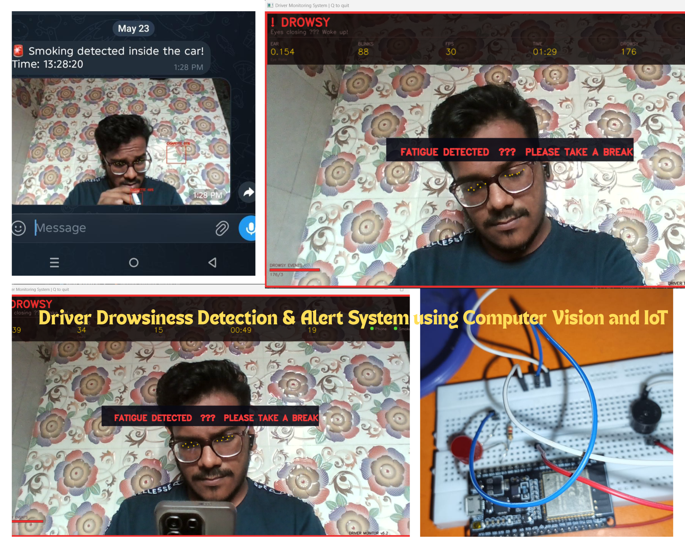

# Smart Driver Monitoring System

An AI-powered real-time Driver Monitoring System designed to improve road safety using Computer Vision, Deep Learning, and Human Behavior Analysis.

The system continuously monitors the driver through a webcam and detects critical events such as drowsiness, smoking, face absence, and distraction. It provides real-time voice alerts and can send Telegram notifications for safety-critical events.

---

## 📌 Features

### 😴 Drowsiness Detection
- Eye Aspect Ratio (EAR) based monitoring
- Detects prolonged eye closure
- Real-time voice warnings

### 🚬 Smoking Detection
- YOLO-based custom object detection model
- Detects smoking activity in real time
- Telegram alert integration

### 👀 Face Monitoring
- MediaPipe Face Mesh
- Detects face absence
- Tracks facial landmarks

### 🔊 Smart Voice Alerts
- Microsoft Edge Neural TTS
- Natural voice notifications
- Real-time event announcements

### 📊 Event Logging
- Automatic CSV logging
- Timestamped event records
- Easy analysis of driver behavior

### ⚡ Real-Time Processing
- Webcam-based monitoring
- Low-latency detection pipeline
- Optimized for edge devices

---

## 🛠️ Tech Stack

| Category | Technology |
|-----------|------------|
| Language | Python |
| Computer Vision | OpenCV |
| Face Tracking | MediaPipe |
| Object Detection | YOLOv8 |
| Deep Learning | PyTorch |
| Voice Alerts | Edge-TTS |
| Communication | PySerial |
| Data Handling | NumPy, CSV |

---

## 📂 Project Structure

```text
driver_monitor_v6
│
├── .gitignore
├── README.md
│
└── driver_monitor
    │
    ├── driver_monitor.py
    ├── test.py
    │
    ├── models
    │   ├── smoking_detection_trained2.pt
    │   └── yolov8n.pt
    │
    └── logs
        └── .gitkeep
```

---

## 📸 Sample Output




---

## ⚙️ Installation

### Clone Repository

```bash
git clone https://github.com/yourusername/driver-monitoring-system.git
cd driver-monitoring-system
```

### Install Dependencies

```bash
pip install -r requirements.txt
```

Or manually:

```bash
pip install torch torchvision
pip install opencv-python mediapipe numpy pyserial ultralytics edge-tts pygame
```

---

## ▶️ Running the Project

```bash
python driver_monitor.py
```

---

## 🚨 Detection Events

| Event | Response |
|---------|---------|
| Drowsiness Detected | Voice Alert |
| Smoking Detected | Voice Alert + Telegram Alert |
| Face Not Detected | Warning Alert |
| Eyes Closed Too Long | Drowsiness Trigger |
| Normal State | Continuous Monitoring |

---

## 📈 Future Improvements

- ROS 2 Integration
- Driver Emotion Recognition
- Mobile Monitoring Dashboard
- Cloud-Based Analytics
- Multi-Camera Support
- Edge AI Deployment (Jetson / Raspberry Pi)

---

## 💡 Applications

- Smart Vehicles
- Fleet Management
- Transportation Safety
- Driver Assistance Systems
- Research in Human Behavior Analysis

---

## 👨‍💻 Author

**Harsh Yadav**

AI • Computer Vision • Robotics • Embedded Systems

GitHub: https://github.com/Harsh-Y99

---

## ⭐ Support

If you found this project useful, consider giving it a star on GitHub.
